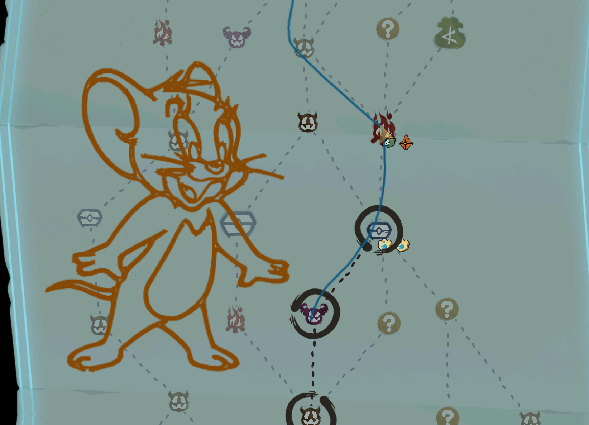
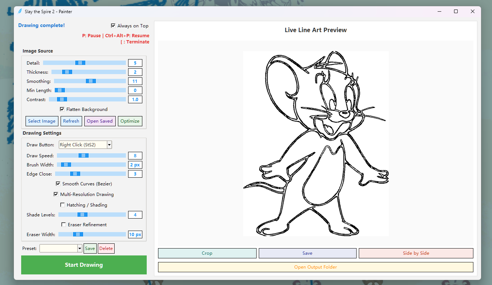

# Slay the Spire 2 - Map Auto-Painter

An automation tool for the drawing mechanic in Slay the Spire 2. This tool translates images, text, and custom line art into in-game mouse strokes for drawing art.

---

## Quick Start (No Setup Required)

For most users, no Python installation is needed. Follow these steps to start drawing:

1. **Download:** Grab the latest SlaytheSpire2Drawing.exe from the [Releases](../../releases) page.
3. **Run as Admin:** Right-click SlaytheSpire2Drawing.exe and select "Run as Administrator". 
   > *Note: Admin rights are required for the tool to simulate mouse movements and listen for emergency stop hotkeys.*
4. **Select & Draw:**
   - Choose your mode (Image, Text, or Fill).
   - Click "Start Drawing"—your screen will dim and freeze.
   - Drag a box over the area in the game where you want to draw.
   - Release the mouse and the bot will begin.

### In-Game Controls
* **P**: Pause (immediately releases the mouse).
* **Ctrl + Alt + P**: Resume from where you paused.
* **[**: Abort the task entirely.

---

## Examples

Here's what the app looks like and what it can produce:




---

## Features

* **Image to Line Art:** Edge-preserving bilateral denoising + adaptive Canny edge detection turns any .png or .jpg into traceable line art.
* **Contrast Enhancement (CLAHE):** Boosts low-contrast images before edge detection for cleaner results.
* **Bezier Curve Smoothing:** Optional cubic bezier fitting produces smoother strokes with fewer points.
* **Hatching / Shading:** Adds crosshatch shading based on image brightness — darker regions get denser lines.
* **Multi-Resolution Drawing:** Draws coarse structure first, then fine detail. Gives a usable result faster if you abort early.
* **Smart Stroke Ordering (2-opt):** Minimizes pen-up travel between strokes for faster, cleaner drawings.
* **Eraser Refinement:** Optional three-pass system (draw thick → erase excess → redraw detail) with calibratable eraser width.
* **Live Preview:** Zoomable, pannable preview that simulates exactly what the bot will draw. Side-by-side mode shows the original next to the line art.
* **Optimize Button:** Auto-tunes settings for any image (see below).
* **Preset Profiles:** Save and reload named parameter sets for different image types.
* **Undo / Redo:** Ctrl+Z / Ctrl+Y rolls settings back through history.
* **Progress + ETA:** Live percentage and time estimate during drawing.
* **Smooth Stroke Engine:** Simulates natural mouse dragging — adaptive speed on curves, pen lifts on sharp turns.
* **Multi-Monitor Support:** Correctly handles coordinate mapping across different screen resolutions and "Virtual Desktop" setups.
* **Area Filling:** "Fog of War" mode fills a designated area with a configurable crosshatch pattern.

---

## The Optimize Button

The **Optimize** button runs a multi-phase search across detail, smoothing, edge close, contrast, thickness, and speed values to find a reasonable starting point for your image. It scores each combination by how well the resulting edges line up with the actual gradients in the source image.

**It's not perfect.** The optimizer is a heuristic — it gets you in the right ballpark, but the "best" settings for any given image are subjective. Treat its output as a starting point, not a final answer.

**Playing around with the sliders will produce the best results.** A few tips:
- **Detail** controls edge sensitivity. Bump it up for more lines, down for cleaner output.
- **Smoothing** uses an edge-preserving bilateral filter — it removes noise without blurring real edges. Higher values help with noisy or photographic source images.
- **Contrast (CLAHE)** is great for washed-out images. Try values between 2-4 if your source is low-contrast.
- **Min Length** strips speckle noise — useful when you have lots of tiny disconnected dots.
- **Edge Close** bridges small gaps in the edges. Increase if your lines look broken up.
- **Flatten Background** is a quick win for images with a solid background color.
- **Smooth Curves** (bezier) helps for organic shapes; turn it off for hard-edged geometric images.

The live preview updates as you tweak, so iterate until it looks right before drawing.

---

## Developer & Technical Info

This repository is a refactored fork of the original [Slay-the-Spire-2-Drawing](https://github.com/SKYFIRE5836/Slay-the-Spire-2-Drawing) project. 

### Architecture
The project has been refactored into a modular package structure to separate concerns and improve maintainability:
* **SlaytheSpire2Drawing.py**: The entry point script that initializes the application.
* **spire_painter/**: The core logic package.
    * **app.py**: Manages the main application lifecycle and GUI coordination.
    * **image_processing.py**: Handles OpenCV-based edge detection and coordinate generation.
    * **drawing.py**: Contains the low-level mouse simulation and stroke logic.
* **output_lines/**: Contains required assets such as `brush.ico`.

### Running from Source
If you prefer to run the script manually, ensure you have Python 3.10+ installed:

```bash
# Install dependencies
pip install -r requirements.txt

# Run the application
python SlaytheSpire2Drawing.py
```

### Building the Executable
To package the app yourself using PyInstaller, ensure you include the required data directories:
```bash
python -m PyInstaller --onefile --noconsole --icon=output_lines/brush.ico SlaytheSpire2Drawing.py
```

---

## FAQ

**Why does my antivirus flag the .exe?**
The tool uses global keyboard hooks (for the Pause key) and simulates mouse input. Unsigned binaries performing these actions often trigger heuristic warnings. You can audit the source code in this repo and add an exclusion to your antivirus.

**The lines are jagged or shifting.**
Try lowering the Speed slider. If the drawing is offset, ensure your Windows "Scale and Layout" settings are consistent across monitors.
